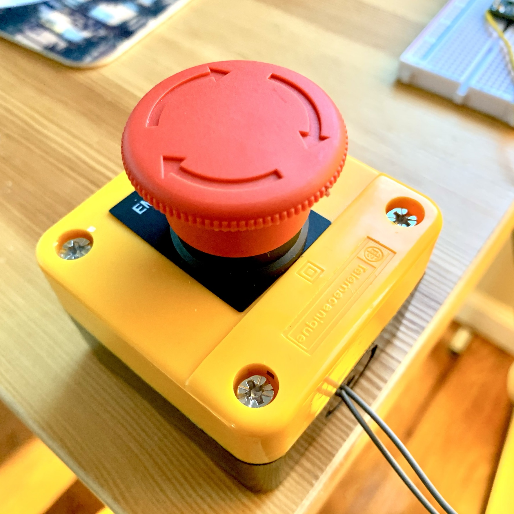
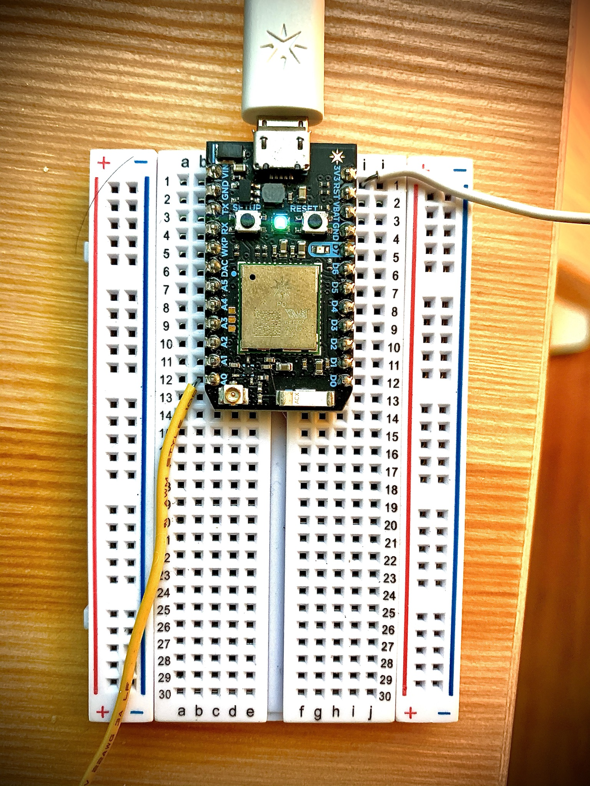

# End Zoom Meeting Button

A physical button that ends Zoom meetings

<p align="center">
  
  
</p>


### Hardware Requirements

- virtually any button or switch
- Particle Photon
- micro-usb cable

### Pinout

```
Pin 3V3 -> Normally Opened terminal
Pin A0  -> Common
```

### Tested On
- Ubuntu 18.04


